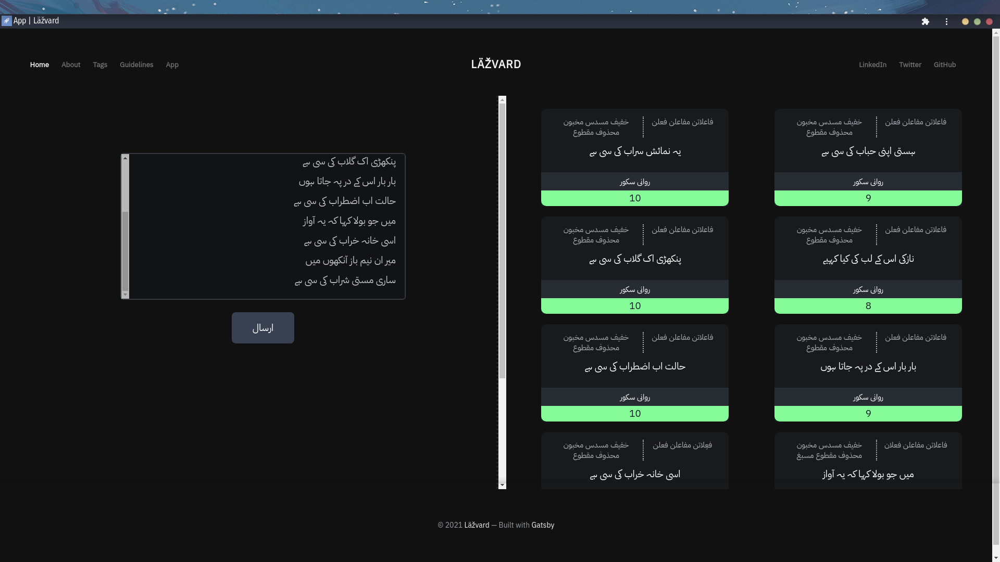
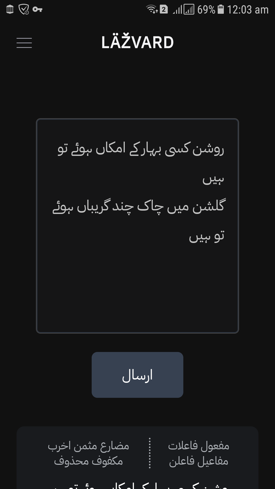
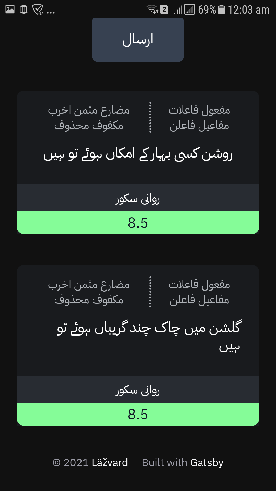

<!-- AUTO-GENERATED-CONTENT:START (STARTER) -->

  

<h1 align="center">
  Läžvard لاژورد
</h1>

### App geared towards linguistics and literature with a focus on prosody and poetry.
---

I recently contemplated rewriting my metrical scansion engine for Urdu in Typescript as part of a the second version of my web application. The objectives and the outcomes of the project have been listed listed below. 

### Objectives

- Pure Typescript implementation to remove the need for a backend.
- Experiment with newer UI/UX techniques.
- Make a Single Page Application for a more fluid experience.
- Make an installable Progressive Web App that can run on all platforms.

### Result

- The app engine turned out fine. Slower than my C++ implementation but still reasonably fast. It's mostly a rewrite of my Kotlin implementation.
- Clean codebase that relies heavily on functional programming techniques.
- Installable Progressive Web App that can work offline on all platforms.
- Fluid UI with Gatsby and React.

Eventually I decided to embed the app into a multipurpose website with a modern user interface.

### Technologies Used 

* [Typescript](https://Typescriptlang.org/)
* [React](https://reactjs.org/)
* [Gatsby](https://www.gatsbyjs.com/)
* [TailwindCSS](https://tailwindcss.com/)

### Showcase

<table><tr>
<td>  
<td>  
</tr></table>